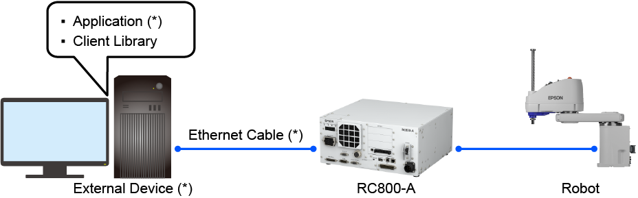
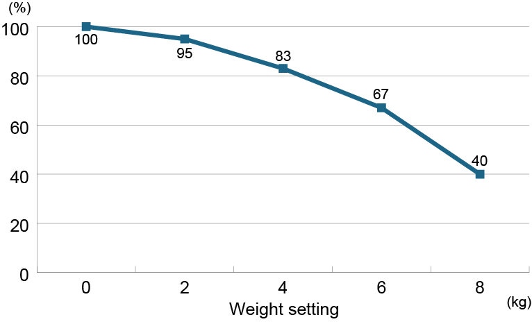
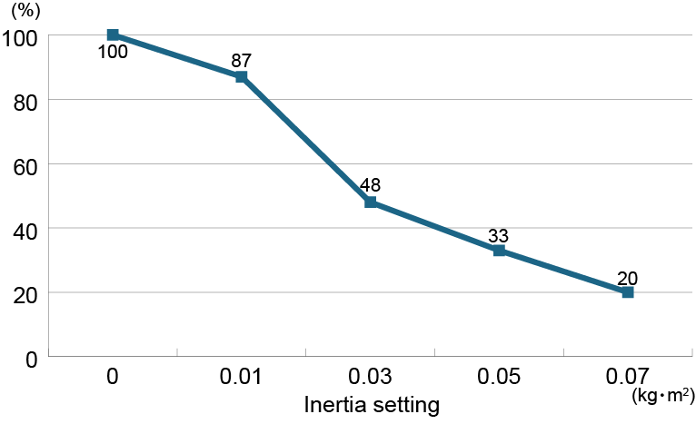
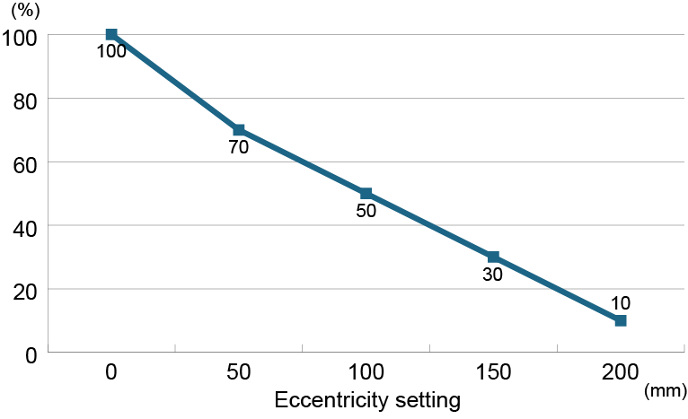

# エプソンロボット リアルタイム動作指令用 クライアントライブラリー

[日本語](./readme_ja.md) / [English](./readme.md)

## 1. リアルタイム動作指令用 クライアントライブラリーについて

このライブラリーは、エプソン製ロボットコントローラーでリアルタイム動作指令機能を利用するためのクライアントライブラリーです。以下のような機能が利用でき、外部装置で計算した経路計画/軌道計画を使用するアプリケーションを作成できます。

- 外部装置からモーターを励磁
- 外部装置で計画された経路/軌道に基づく動作指令値を使用してロボットを制御



<sup>\*</sup> 以下のものはエプソンから提供されません。お客様でご用意ください。

- External Device: ロボットを制御する外部装置
- Application: ロボットを制御するアプリケーション
- Ethernet Cable: 外部装置とRC800-Aを接続するイーサネットケーブル

ROS2を利用して本機能を使用する場合は、以下のreadmeも参照してください。

https://github.com/Epson-Robots/epson-robot-ros2.git

### 1.1 注意事項

- 経路/軌道を計画する機能は弊社から提供されません。お客様で用意、開発してください。
- リアルタイム動作指令は、エプソン製ロボットコントローラーの外部で計画された経路/軌道に基づく動作指令値にしたがって、ロボットを動作させる高度な機能です。経路計画/軌道計画について十分に理解して、ご利用ください。

## 2. 必要な機材

- エプソン製産業用ロボット

    使用できる機種について詳細は、[対応機種](#21-対応機種)を参照してください。
- エプソン製ロボットコントローラー

    リアルタイム動作指令はコントローラーRC800 (Ver 8.1.1.0以上)で利用できます。事前に、コントローラーオプション"Real-time Motion Control"を購入、有効化します。詳細は以下を参照してください。  
    "Epson RC+ 8.0 ユーザーズガイド"
- Windows PC、USBケーブル

    Epson RC+ 8.0をインストールして、コントローラーにリアルタイム動作指令に関する設定をします。

    このPCとコントローラーはUSBケーブルで接続します。コントローラー側のPC接続用コネクターは、USB Type-Bです。
- Epson RC+ 8.0 (Ver 8.1.1.0以上)

    Epson RC+ 8.0は、エプソン製ロボットの統合開発環境であるWindowsアプリケーションです。コントローラーに対してリアルタイム動作指令を利用するための設定に必要です。
- Linux PC、イーサネットケーブル

    クライアントライブラリーを利用するのに必要です。推奨環境は、[Linux PCの推奨環境](#22-linux-pcの推奨環境)参照してください。

    このPCとコントローラーはイーサネットケーブルで接続する必要があります。
- その他産業用ロボットに必要な環境

    コントローラーに安全扉と非常停止ボタンを必ず接続してください。

### 2.1 対応機種

リアルタイム動作指令に対応する機種は以下の機種です。

**スカラロボット**

- GX4-C251S
- GX4-C301S
- GX4-C351S
- GX4-C351S-L
- GX4-C351S-R

**6軸ロボット**

- C8-C901S
- C8-C1401S
- C12-C1401S

### 2.2 Linux PCの推奨環境

クライアントライブラリーを利用するLinux PCの推奨環境は以下の通りです。すべてのPCでの動作を保証するものではありません。

- OS: Ubuntu22.04LTS
- CPU: Intel Core i7以上
- メモリー: 16GB以上

## 3. クライアントライブラリーを利用するためのLinux PCの環境構築手順

クライアントライブラリーでは、依存ライブラリーとしてFastDDS2.14.4が必要です。以下の手順にしたがって、FastDDDS2.14.4とクライアントライブラリーをインストールしてください。

FastDDSに関する詳細は次のウェブサイトを参照ください。  
https://fast-dds.docs.eprosima.com/en/v2.14.4/index.html

1. クライアントライブラリーの依存ライブラリーをビルドするのに必要なパッケージをインストールします。

    ```shell-session
    sudo apt install cmake g++ python3-pip wget git python3-colcon-common-extensions
    pip3 install -U vcstool
    ```

2. Asioをインストールします。

    ```shell-session
    sudo apt install libasio-dev
    ```

3. TinyXML2をインストールします。

    ```shell-session
    sudo apt install libtinyxml2-dev
    ```

4. オープンSSLをインストールします。

    ```shell-session
    sudo apt install libssl-dev
    ```

5. FastDDSとその依存関係をインストールするために使用するリポジトリファイルをダウンロードします。

    ```shell-session
    mkdir ~/FastDDS
    cd FastDDS
    wget https://raw.githubusercontent.com/eProsima/Fast-DDS/2.14.4/fastrtps.repos
    mkdir src
    vcs import src < fastrtps.repos
    ```

6. foonathan_memoryのバージョンを指定します。

   ~/FastDDS/src/foonathan_memory_vendorのフォルダーのCMakeLists.txtにて、foonathan_memoryのバーションを以下のように指定してください。
    ```shell-session
    find_package(foonathan_memory 1.3.1 QUIET)
    ```

7. FastDDSをビルドします。

    ```shell-session
    colcon build --cmake-args -DBUILD_SHARED_LIBS=OFF -DSECURITY=ON -DCMAKE_C_FLAGS=-fPIC -DCMAKE_CXX_FLAGS=-fPIC
    ```

8. ホームディレクトリーにクライアントライブラリーをgit cloneします。

    ```shell-session
    git clone https://github.com/Epson-Robots/rtmc-client-library.git
    ```

9.  クライアントライブラリーをビルドします。

    これまでの手順に記載したパスを指定してFastDDSをリンクします。ディレクトリーを作成したり、FastDDSのビルド時にインストールパスを変更したときは、本パッケージのCMakeList.txtを変更する必要があります。

    ```shell-session
    cd rtmc-client-library
    mkdir build
    cd build
    cmake ..
    make
    ```

## 4. コントローラーのセットアップ

Linux PCにてクライアントライブラリーを利用する前に、コントローラーにリアルタイム動作指令に関する設定をします。

設定手順の詳細は、以下のマニュアルを参照してください。  
"Epson RC+ 8.0 ユーザーズガイド - リアルタイム動作指令"

## 5. クライアントライブラリーの使い方

### 5.1 アプリケーション作成時

Linux PCのアプリケーションでクライアントライブラリーに含まれる以下のヘッダーファイルをインクルードしてください。アプリケーションはLinux PCで作成してください。

- include/rtmc/rtmc_client.h: クライアントライブラリーで利用できるAPIが定義されたヘッダーファイル
- include/rtmc/rtmc_definition.h: APIの引数として利用できる値、APIでの取得値、APIの戻り値が定数として定義されたヘッダーファイル

### 5.2 アプリケーション実行時

Linux PC側の手順を以下に示します。[コントローラーのセットアップ](#4-コントローラーのセットアップ)を事前に完了させてください。

1. Linux PCのIPアドレスをコントローラーと同じネットワークに設定します。
2. Linux PCとコントローラーをイーサネットケーブルで接続します。
3. コントローラーの電源をオンにします。
4. コントローラーのLEDが"AUTO"のみ点滅状態になるまで待ちます。

コントローラーが、Linux PCアプリケーションからの要求を受け入れ可能な状態になります。[API一覧](#53-api一覧)に記載しているAPIは、[要求受付条件]が成立している場合に機能します。

### 5.3 API一覧

クライアントライブラリーで利用できるAPIは以下の通りです。APIの戻り値は、[APIの戻り値](#54-apiの戻り値)を参照してください。

アプリケーションがクライアントライブラリーをロードできるようにLD_LIBRARY_PATHなどを設定してください。

#### RTMC_Connect

コントローラーとリアルタイム動作指令用の通信を開始します。通信確立時にパスワード認証を実施します。

コントローラーのIPアドレス/ビルトインメッセージ用ポート番号を変更したときは、本関数を実行する前に[Set_ComProperty](#set_comproperty)関数を実行し、接続先のロボットコントローラーを特定してください。

[書式]

```shell-session
short RTMC_Connect(std::string password)
```

[引数]

- IN
    - password: 認証用のパスワード
- OUT
    - なし

[要求受付条件]

|項目|条件|
|--|--|
|通信状態|通信未確立|
|操作モード|-|
|ロボット機種一致確認 ([RBCheck](#rbcheck))|-|
|リアルタイム動作指令制御モード ([Set_RTMCModeEnable](#set_rtmcmodeenable))|無効|
|Safeguard|-|
|非常停止状態|-|
|コントローラーのエラー|-|


[CLIENT_ERRの失敗要因]

- パスワード認証の失敗。パスワードが正しいことを確認してください。
- コントローラーオプションが無効状態。コントローラーオプションを有効化してください。

#### RTMC_DisConnect

コントローラーとのリアルタイム動作指令用の通信を切断します。

[書式]

```shell-session
short RTMC_DisConnect()
```

[引数]

なし

[要求受付条件]

|項目|条件|
|--|--|
|通信状態|確立済み|
|操作モード|-|
|ロボット機種一致確認 ([RBCheck](#rbcheck))|-|
|リアルタイム動作指令制御モード ([Set_RTMCModeEnable](#set_rtmcmodeenable))|無効|
|Safeguard|-|
|非常停止状態|-|
|コントローラーのエラー|-|


[CLIENT_ERRの失敗要因]

コントローラーとの通信を異常切断。コントローラーを再起動してください。

#### RBCheck

Linux PCのアプリケーションで制御しようとしているロボット機種と、コントローラーに設定されているロボット機種が同一であることを確認します。本関数による確認結果は、コントローラーの電源をオフするまで保持されます。

本関数の実行が成功すると、以下の関数による要求がコントローラーで受付可能になります。各関数の詳細は、それぞれの項目を参照してください。

- [MotorOn](#motoron)
- [MotorOff](#motoroff)
- [PowerHigh](#powerhigh)
- [PowerLow](#powerlow)
- [Set_RTMCModeEnable](#set_rtmcmodeenable)
- [Set_RTMCModeDisable](#set_rtmcmodedisable)
- [Exec_RTMC](#exec_rtmc) <sup>\*</sup>
- [Set_Weight](#set_weight)
- [Set_Inertia](#set_inertia)

<sup>\*</sup> [Exec_RTMC](#exec_rtmc)関数による要求をロボットコントローラーで受け付けるには、事前に[Set_RTMCModeEnable](#set_rtmcmodeenable)関数を実行し、リアルタイム動作指令制御モードを有効化してください。

[書式]

```shell-session
short RBCheck(std::string rb_model)
```

[引数]

- IN
    - rb_model: Linux PCのアプリケーションで制御しようとしているロボット機種

        ロボット機種については、[対応機種](#21-対応機種)を参照してください。
- OUT
    - なし

[要求受付条件]

|項目|条件|
|--|--|
|通信状態|確立済み|
|操作モード|Auto|
|ロボット機種一致確認 ([RBCheck](#rbcheck))|-|
|リアルタイム動作指令制御モード ([Set_RTMCModeEnable](#set_rtmcmodeenable))|無効|
|Safeguard|-|
|非常停止状態|-|
|コントローラーのエラー|-|


[CLIENT_ERRの失敗要因]

rb_modelで指定したロボット機種と、コントローラーに設定されているロボット機種の不一致。rb_modelで指定したロボット機種が正しいことを確認してください。

#### RBCheckResult

コントローラーに保持されたRBCheck関数の結果を確認します。

[書式]

```shell-session
short RBCheckResult()
```

[引数]

なし

[要求受付条件]

|項目|条件|
|--|--|
|通信状態|確立済み|
|操作モード|Auto|
|ロボット機種一致確認 ([RBCheck](#rbcheck))|-|
|リアルタイム動作指令制御モード ([Set_RTMCModeEnable](#set_rtmcmodeenable))|無効|
|Safeguard|-|
|非常停止状態|-|
|コントローラーのエラー|-|


[CLIENT_ERRの失敗要因]

コントローラーで保持しているロボット機種一致確認の結果が"不一致"。

#### Get_RBModel

コントローラーに設定されているロボット機種を取得します。

[書式]

```shell-session
short Get_RBModel(std::string* prb_model)
```

[引数]

- IN
    - なし
- OUT
    - prb_model: コントローラーから取得したロボット機種名

[要求受付条件]

|項目|条件|
|--|--|
|通信状態|確立済み|
|操作モード|Auto|
|ロボット機種一致確認 ([RBCheck](#rbcheck))|-|
|リアルタイム動作指令制御モード ([Set_RTMCModeEnable](#set_rtmcmodeenable))|無効|
|Safeguard|-|
|非常停止状態|-|
|コントローラーのエラー|-|

#### Set_RTMCSendFormat

[Exec_RTMC](#exec_rtmc)関数で制御する対象を指定します。これを動作指令型と呼びます。動作指令型は以下の2通りです。

- パターン1: ロボット
- パターン2: ロボット+標準I/O出力 (2Byte)

設定した動作指令型は、コントローラーの電源をオフするまで保持されます。デフォルトの動作指令型は、パターン1です。

[書式]

```shell-session
short Set_RTMCSendFormat(unsigned short sendformat)
```

[引数]

- IN
    - sendformat: 設定する動作指令型

        Linux PCのアプリケーションで制御したい対象にあわせて、以下のように指定します。

        - パターン1: 0
        - パターン2: 1
- OUT
    - なし

[要求受付条件]

|項目|条件|
|--|--|
|通信状態|確立済み|
|操作モード|Auto|
|ロボット機種一致確認 ([RBCheck](#rbcheck))|-|
|リアルタイム動作指令制御モード ([Set_RTMCModeEnable](#set_rtmcmodeenable))|無効|
|Safeguard|-|
|非常停止状態|-|
|コントローラーのエラー|-|


[CLIENT_ERRの失敗要因]

標準I/OにリモートI/Oが割り当てられている。リモートI/Oが割り当てられている標準I/Oを未使用に変更してください。詳細は以下のマニュアルを参照してください。  
"Epson RC+ 8.0 ユーザーズガイド - リアルタイム動作指令の事前設定"

#### Get_RTMCSendFormat

コントローラーに設定した動作指令型を取得します。動作指令型については、[Set_RTMCSendFormat](#set_rtmcsendformat)関数を参照してください。

[書式]

```shell-session
short Get_RTMCSendFormat(unsigned short* psendformat)
```

[引数]

- IN
    - なし
- OUT
    - psendformat: 取得した動作指令型

[要求受付条件]

|項目|条件|
|--|--|
|通信状態|確立済み|
|操作モード|Auto|
|ロボット機種一致確認 ([RBCheck](#rbcheck))|-|
|リアルタイム動作指令制御モード ([Set_RTMCModeEnable](#set_rtmcmodeenable))|無効|
|Safeguard|-|
|非常停止状態|-|
|コントローラーのエラー|-|

#### Set_RTMCRecvFormat

[Exec_RTMC](#exec_rtmc)関数の実行結果として取得するデータの形式を指定します。これを現在値型と呼びます。現在値型は以下の2通りです。

- パターン1: ロボット
- パターン2: ロボット+標準I/O入力(3Byte)

設定した現在値型は、コントローラーの電源をオフするまで保持されます。デフォルトの現在値型は、パターン1です。

[書式]

```shell-session
short Set_RTMCRecvFormat(unsigned short recvformat)
```

[引数]

- IN
    - recvformat: 設定する現在値型

        Linux PCのアプリケーションで制御したい対象にあわせて、以下のように指定します。

        - パターン1: 0
        - パターン2: 1
- OUT
    - なし

[要求受付条件]

|項目|条件|
|--|--|
|通信状態|確立済み|
|操作モード|Auto|
|ロボット機種一致確認 ([RBCheck](#rbcheck))|-|
|リアルタイム動作指令制御モード ([Set_RTMCModeEnable](#set_rtmcmodeenable))|無効|
|Safeguard|-|
|非常停止|-|
|コントローラーのエラー|-|

#### Get_RTMCRecvFormat

コントローラーに設定した現在値型を取得します。現在値型については、[Set_RTMCRecvFormat](#set_rtmcrecvformat)関数を参照してください。

[書式]

```shell-session
short Get_RTMCRecvFormat(unsigned short* precvformat)
```

[引数]

- IN
    - なし
- OUT
    - precvformat: 取得した現在値型

[要求受付条件]

|項目|条件|
|--|--|
|通信状態|確立済み|
|操作モード|Auto|
|ロボット機種一致確認 ([RBCheck](#rbcheck))|-|
|リアルタイム動作指令制御モード ([Set_RTMCModeEnable](#set_rtmcmodeenable))|無効|
|Safeguard|-|
|非常停止状態|-|
|コントローラーのエラー|-|

#### Set_Weight

ロボット動作に関わるパラメーターを最適化するため、ハンド質量を指定します。[Exec_RTMC](#exec_rtmc)関数でロボットを制御する前に、本関数でハンド質量を適切に設定してください。

コントローラーの電源をオフしても、設定値は維持されます。

[書式]

```shell-session
short Set_Weight(double set_weight)
```

[引数]

- IN
    - set_weight: ハンドの質量 (単位: kg)
- OUT
    - なし

[要求受付条件]

|項目|条件|
|--|--|
|通信状態|確立済み|
|操作モード|Auto|
|ロボット機種一致確認 ([RBCheck](#rbcheck))|済み|
|リアルタイム動作指令制御モード ([Set_RTMCModeEnable](#set_rtmcmodeenable))|無効|
|Safeguard|-|
|非常停止状態|-|
|コントローラーのエラー|-|

#### Get_Weight

ロボットコントローラーに設定したハンド質量の設定値を取得します。

[書式]

```shell-session
short Get_Weight(double* pget_weight)
```

[引数]

- IN
    - なし
- OUT
    - pget_weight: 取得したハンドの質量 (単位: kg)

[要求受付条件]

|項目|条件|
|--|--|
|通信状態|確立済み|
|操作モード|Auto|
|ロボット機種一致確認 ([RBCheck](#rbcheck))|-|
|リアルタイム動作指令制御モード ([Set_RTMCModeEnable](#set_rtmcmodeenable))|無効|
|Safeguard|-|
|非常停止状態|-|
|コントローラーのエラー|-|

#### Set_Inertia

ロボット動作に関わるパラメーターを最適化するため、ハンドおよびワークを含む負荷イナーシャ、偏心量を指定します。[Exec_RTMC](#exec_rtmc)関数でロボットを制御する前に、本関数でハンドおよびワークを含む負荷イナーシャ、偏心量を適切に設定してください。

コントローラーの電源をオフしても、設定値は維持されます。

[書式]

```shell-session
short Set_Inertia(double set_inertia,unsigned short set_eccentricity)
```

[引数]

- IN
    - set_inertia: 負荷イナーシャ (単位: kgm^2)
    - set_eccentricity: 偏心量 (単位: mm, 省略可能)
- OUT
    - なし

[要求受付条件]

|項目|条件|
|--|--|
|通信状態|確立済み|
|操作モード|Auto|
|ロボット機種一致確認 ([RBCheck](#rbcheck))|済み|
|リアルタイム動作指令制御モード ([Set_RTMCModeEnable](#set_rtmcmodeenable))|無効|
|Safeguard|-|
|非常停止状態|-|
|コントローラーのエラー|-|

#### Get_Inertia

コントローラーに設定したハンドおよびワークの負荷イナーシャ、偏心量の設定値を取得します。

[書式]

```shell-session
short Get_Inertia(double* pget_inertia, unsigned short* pget_eccentricity)
```

[引数]

- IN
    - なし
- OUT
    - pget_inertia: 取得した負荷イナーシャ (単位: kgm^2)
    - pget_eccentricity: 取得した偏心量 (単位: mm, 省略可能)

[要求受付条件]

|項目|条件|
|--|--|
|通信状態|確立済み|
|操作モード|Auto|
|ロボット機種一致確認 ([RBCheck](#rbcheck))|-|
|リアルタイム動作指令制御モード ([Set_RTMCModeEnable](#set_rtmcmodeenable))|無効|
|Safeguard|-|
|非常停止状態|-|
|コントローラーのエラー|-|

#### MotorON

コントローラーに接続されたロボットのモーターを励磁します。

[書式]

```shell-session
short MotorOn()
```

[引数]

- IN
    - なし
- OUT
    - なし

[要求受付条件]

|項目|条件|
|--|--|
|通信状態|確立済み|
|操作モード|Auto|
|ロボット機種一致確認 ([RBCheck](#rbcheck))|済み|
|リアルタイム動作指令制御モード ([Set_RTMCModeEnable](#set_rtmcmodeenable))|無効|
|Safeguard| Close |
|非常停止|オフ|
|コントローラーのエラー|無し|

#### MotorOff

コントローラーに接続されたロボットのモーターを非励磁します。

[書式]

```shell-session
short MotorOff()
```

[引数]

- IN
    - なし
- OUT
    - なし

[要求受付条件]

|項目|条件|
|--|--|
|通信状態|確立済み|
|操作モード|Auto|
|ロボット機種一致確認 ([RBCheck](#rbcheck))|済み|
|リアルタイム動作指令制御モード ([Set_RTMCModeEnable](#set_rtmcmodeenable))|無効|
|Safeguard| Close |
|非常停止|オフ|
|コントローラーのエラー|無し|

#### Get_MotorStatus

コントローラーに接続されたロボットのモーター状態を取得します。

[書式]

```shell-session
short Get_MotorStatus(bool* pmotor_stauts)
```

[引数]

- IN
    - なし
- OUT
    - pmotor_statu: 取得したモーター状態
        - モーター励磁状態: true
        - モーター非励磁状態: false

[要求受付条件]

|項目|条件|
|--|--|
|通信状態|確立済み|
|操作モード|Auto|
|ロボット機種一致確認 ([RBCheck](#rbcheck))|-|
|リアルタイム動作指令制御モード ([Set_RTMCModeEnable](#set_rtmcmodeenable))|無効|
|Safeguard|-|
|非常停止|-|
|コントローラーのエラー|-|

#### PowerHigh

ロボットをハイパワーモードに設定します。本関数の実行が成功すると、高速なロボット動作が可能になります。

[書式]

```shell-session
short PowerHigh()
```

[引数]

- IN
    - なし
- OUT
    - なし

[要求受付条件]

|項目|条件|
|--|--|
|通信状態|確立済み|
|操作モード|Auto|
|ロボット機種一致確認 ([RBCheck](#rbcheck))|済み|
|リアルタイム動作指令制御モード ([Set_RTMCModeEnable](#set_rtmcmodeenable))|無効|
|Safeguard|-|
|非常停止|-|
|コントローラーのエラー|-|

#### PowerLow

ロボットをローパワーモードに設定します。本関数の実行が成功すると、ロボット動作速度が制限されます。

モーター励磁時のパワーモードは、ローパワーモードです。

[書式]

```shell-session
short PowerLow()
```

[引数]

- IN
    - なし
- OUT
    - なし

[要求受付条件]

|項目|条件|
|--|--|
|通信状態|確立済み|
|操作モード|Auto|
|ロボット機種一致確認 ([RBCheck](#rbcheck))|済み|
|リアルタイム動作指令制御モード ([Set_RTMCModeEnable](#set_rtmcmodeenable))|無効|
|Safeguard|-|
|非常停止|-|
|コントローラーのエラー|-|

#### Get_PowerMode

モーターの現在のパワーモードを取得します。

[書式]

```shell-session
short Get_PowerMode(bool* ppower_mode)
```

[引数]

- IN
    - なし
- OUT
    - ppower_mode: 取得したパワーモード
        - ハイパワーモード: true
        - ローパワーモード: false

[要求受付条件]

|項目|条件|
|--|--|
|通信状態|確立済み|
|操作モード|Auto|
|ロボット機種一致確認 ([RBCheck](#rbcheck))|-|
|リアルタイム動作指令制御モード ([Set_RTMCModeEnable](#set_rtmcmodeenable))|無効|
|Safeguard|-|
|非常停止|-|
|コントローラーのエラー|-|

#### Set_RTMCModeEnable

リアルタイム動作指令制御モードを有効化します。本関数の実行が成功すると、[Exec_RTMC](#exec_rtmc)関数を使用して、リアルタイム動作指令でロボット制御ができるようになります。

設定したリアルタイム動作指令制御モードは、以下のいずれかの状態となるまでコントローラーで保持されます。

- コントローラーでエラーが発生
- コントローラーが非常停止状態
- コントローラーに接続された安全扉が開扉
- 通信切断
- [Set_RTMCModeDisable](#set_rtmcmodedisable)の実行が成功

上記のいずれかの条件を満たした場合、リアルタイム動作指令制御モードは自動的に無効化されます。

[書式]

```shell-session
short Set_RTMCModeEnable()
```

[引数]

- IN
    - なし
- OUT
    - なし

[要求受付条件]

|項目|条件|
|--|--|
|通信状態|確立済み|
|操作モード|Auto|
|ロボット機種一致確認 ([RBCheck](#rbcheck))|済み|
|リアルタイム動作指令制御モード ([Set_RTMCModeEnable](#set_rtmcmodeenable))|-|
|Safeguard| Close |
|非常停止|オフ|
|コントローラーのエラー|無し|


[CLIENT_ERRの失敗要因]

- モーターが非励磁状態。モーターを励磁し、再度関数を実行してください。
- ロボットが減速停止中。再度関数を実行してください。

#### Set_RTMCModeDisable

リアルタイム動作指令制御モードを無効化します。

[書式]

```shell-session
short Set_RTMCModeDisable()
```

[引数]

- IN
    - なし
- OUT
    - なし

[要求受付条件]

|項目|条件|
|--|--|
|通信状態|確立済み|
|操作モード|Auto|
|ロボット機種一致確認 ([RBCheck](#rbcheck))|済み|
|リアルタイム動作指令制御モード ([Set_RTMCModeEnable](#set_rtmcmodeenable))|-|
|Safeguard|-|
|非常停止|-|
|コントローラーのエラー|-|

#### Get_RTMCMode

現在のリアルタイム動作指令制御モードを取得します。

[書式]

```shell-session
short Get_RTMCMode(bool* prtmcmode)
```

[引数]

- IN
    - なし
- OUT
    - prtmcmode: 取得したリアルタイム動作指令制御モード
        - 有効: true
        - 無効: false

[要求受付条件]

|項目|条件|
|--|--|
|通信状態|確立済み|
|操作モード|Auto|
|ロボット機種一致確認 ([RBCheck](#rbcheck))|-|
|リアルタイム動作指令制御モード ([Set_RTMCModeEnable](#set_rtmcmodeenable))|-|
|Safeguard|-|
|非常停止|-|
|コントローラーのエラー|-|

#### Get_CurrentJA

ロボット各関節の現在値を取得します。

[書式]

```shell-session
short Get_CurrentJA(std::vector<double>& pcurja)
```

[引数]

- IN
    - なし
- OUT
    - pcurja: 取得したロボット各関節の現在値 (単位: radまたはmm)

[要求受付条件]

|項目|条件|
|--|--|
|通信状態|確立済み|
|操作モード|-|
|ロボット機種一致確認 ([RBCheck](#rbcheck))|-|
|リアルタイム動作指令制御モード ([Set_RTMCModeEnable](#set_rtmcmodeenable))|無効|
|Safeguard|-|
|非常停止|-|
|コントローラーのエラー|-|

#### Exec_RTMC

動作指令値にしたがって、ロボットを制御します。コントローラー内では、動作指令値を一度バッファーに格納し、コントローラーの制御周期ごとにバッファーの動作指令値を読み出し、ロボットを制御します。コントローラーのバッファーがフルの状態で本関数を実行すると、バッファーが空くまで待機します。バッファーサイズの設定の詳細は、[Set_BufferSize](#set_buffersize)関数および[Get_BufferSize](#get_buffersize)関数を参照してください。

[書式]

```shell-session
short Exec_RTMC(vector<double> jacmd, vector<double>& pcurja, unsigned short iocmd, unsigned int* pcurio, uint8_t* pbufstatus)
```

[引数]

- IN
    - jacmd: 動作指令値 (単位: radまたはmm)
    - iocmd: 標準I/O出力への指令値

        本引数で標準I/O出力を操作するには、動作指令型の設定が必要です。詳細は、[Set_RTMCSendFormat](#set_rtmcsendformat)関数を参照してください。

        2Byteで指定してください。たとえば、15Bit目のみONする場合は、"1000 0000 0000 0000"の10進数となる32768を引数に指定します。

        動作指令型の設定をロボットのみに指定している場合は、本引数を省略可能です。
- OUT
    - pcurja: ロボットの各関節の現在値 (単位: radまたはmm)
    - pcurio: 標準I/O入力の状態

        本引数で標準I/O出力を操作するには、現在値型の設定が必要です。詳細は、[Set_RTMCRecvFormat](#set_rtmcrecvformat)関数を参照してください。

        4Byteで取得できます。たとえば、23Bit目がONの場合、"0000 0000 1000 0000 0000 0000 0000 0000"の10進数となる8388608が本引数から取得できます。

        現在値型の設定をロボットのみに指定している場合は、本引数を省略可能です。
    - pbufstatus: バッファーのステータス (省略可能)
        - 空きがある状態: RTMC_BUFF_OK
        - フルの状態: RTMC_BUFF_FULL

[要求受付条件]

|項目|条件|
|--|--|
|通信状態|確立済み|
|操作モード|Auto|
|ロボット機種一致確認 ([RBCheck](#rbcheck))|済み|
|リアルタイム動作指令制御モード ([Set_RTMCModeEnable](#set_rtmcmodeenable))|有効|
|Safeguard| Close |
|非常停止|オフ|
|コントローラーのエラー|無し|

#### Reset

コントローラーを初期状態にリセットします。

コントローラーの非常停止状態とエラー状態をリセットします。標準I/O出力のすべてのBitをオフにします。

[書式]

```shell-session
short Reset()
```

[引数]

- IN
    - なし
- OUT
    - なし

[要求受付条件]

|項目|条件|
|--|--|
|通信状態|確立済み|
|操作モード|Auto|
|ロボット機種一致確認 ([RBCheck](#rbcheck))|-|
|リアルタイム動作指令制御モード ([Set_RTMCModeEnable](#set_rtmcmodeenable))|無効|
|Safeguard|-|
|非常停止|-|
|コントローラーのエラー|-|

#### Set_BufferSize

[Exec_RTMC](#exec_rtmc)関数で送信する動作指令値を格納するバッファーのサイズを設定します。設定したバッファーサイズは、コントローラーの電源をオフするまで保持されます。デフォルトのバッファーサイズは2です。

[書式]

```shell-session
short Set_BufferSize(unsigned short bufsize)
```

[引数]

- IN
    - bufsize: 設定するバッファーサイズ (2, 5, 10が指定可能)
- OUT
    - なし

[要求受付条件]

|項目|条件|
|--|--|
|通信状態|確立済み|
|操作モード|Auto|
|ロボット機種一致確認 ([RBCheck](#rbcheck))|-|
|リアルタイム動作指令制御モード ([Set_RTMCModeEnable](#set_rtmcmodeenable))|無効|
|Safeguard|-|
|非常停止|-|
|コントローラーのエラー|-|

#### Get_BufferSize

[Exec_RTMC](#exec_rtmc)関数で送信する動作指令値を格納するバッファーのサイズを取得します。

[書式]

```shell-session
short Get_BufferSize(unsigned short* pbufsize)
```

[引数]

- IN
    - なし
- OUT
    - pbufsize: 取得したバッファーサイズ

[要求受付条件]

|項目|条件|
|--|--|
|通信状態|確立済み|
|操作モード|Auto|
|ロボット機種一致確認 ([RBCheck](#rbcheck))|-|
|リアルタイム動作指令制御モード ([Set_RTMCModeEnable](#set_rtmcmodeenable))|無効|
|Safeguard|-|
|非常停止|-|
|コントローラーのエラー|-|

#### Set_DigitalOutput_Bit

指定した標準I/O出力をBit単位で制御します。

[書式]

```shell-session
short Set_DigitalOutput_Bit(uint8_t  bitnum, uint8_t bitdata)
```

[引数]

- IN
    - bitnum: 制御する出力Bit番号
    - bitdata: 制御値
- OUT
    - なし

[要求受付条件]

|項目|条件|
|--|--|
|通信状態|確立済み|
|操作モード|Auto|
|ロボット機種一致確認 ([RBCheck](#rbcheck))|-|
|リアルタイム動作指令制御モード ([Set_RTMCModeEnable](#set_rtmcmodeenable))|無効|
|Safeguard|Close|
|非常停止|オフ|
|コントローラーのエラー|無し|


[CLIENT_ERRの失敗要因]

標準I/OにリモートI/Oが割り当てられている。リモートI/Oが割り当てられている標準I/Oを未使用に変更してください。詳細は以下のマニュアルを参照してください。  
"Epson RC+ 8.0 ユーザーズガイド - リアルタイム動作指令の事前設定"

#### Set_DigitalOutput_Byte

指定した標準I/O出力をByte単位で制御します。

[書式]

```shell-session
short Set_DigitalOutput_Byte(uint8_t  bytenum, uint8_t bytedata)
```

[引数]

- IN
    - bytenum: 制御する出力Byte番号
        - 0Bit～7Bitを制御する場合: 0
        - 8Bit～15Bitを制御する場合: 1
    - bytedata: 制御値

        1Byteで指定してください。たとえば、0Bit～7BitのByte番号に対して、2Bit目と5Bit目のみONする場合は、"0001 0010"の10進数となる18を引数に指定します。
- OUT
    - なし

[要求受付条件]

|項目|条件|
|--|--|
|通信状態|確立済み|
|操作モード|Auto|
|ロボット機種一致確認 ([RBCheck](#rbcheck))|-|
|リアルタイム動作指令制御モード ([Set_RTMCModeEnable](#set_rtmcmodeenable))|無効|
|Safeguard|Close|
|非常停止|オフ|
|コントローラーのエラー|無し|


[CLIENT_ERRの失敗要因]

標準I/OにリモートI/Oが割り当てられている。リモートI/Oが割り当てられている標準I/Oを未使用に変更してください。詳細は以下のマニュアルを参照してください。  
"Epson RC+ 8.0 ユーザーズガイド - リアルタイム動作指令の事前設定"

#### Set_DigitalOutput_Word

指定した標準I/O出力を2Byte同時に制御します。

[書式]

```shell-session
short Set_DigitalOutput_Word(unsigned short worddata)
```

[引数]

- IN
    - worddata: 制御値

        2Byteで指定してください。たとえば、2Bit目と12Bit目のみONする場合は、"0001 0000 0000 0100"の10進数となる4100を引数に指定します。
- OUT
    - なし

[要求受付条件]

|項目|条件|
|--|--|
|通信状態|確立済み|
|操作モード|Auto|
|ロボット機種一致確認 ([RBCheck](#rbcheck))|-|
|リアルタイム動作指令制御モード ([Set_RTMCModeEnable](#set_rtmcmodeenable))|無効|
|Safeguard|Close|
|非常停止|オフ|
|コントローラーのエラー|無し|


[CLIENT_ERRの失敗要因]

標準I/OにリモートI/Oが割り当てられている。リモートI/Oが割り当てられている標準I/Oを未使用に変更してください。詳細は以下のマニュアルを参照してください。  
"Epson RC+ 8.0 ユーザーズガイド - リアルタイム動作指令の事前設定"

#### Get_DigitalOutput_Bit

指定した標準I/O出力Bit番号の状態を取得します。

[書式]

```shell-session
short Get_DigitalOutput_Bit(uint8_t  bitnum, uint8_t* pbitdata)
```

[引数]

- IN
    - bitnum: 取得する出力Bit番号
- OUT
    - pbitdata: 指定したBitの状態
        - OFF: 0
        - ON: 1

[要求受付条件]

|項目|条件|
|--|--|
|通信状態|確立済み|
|操作モード|Auto|
|ロボット機種一致確認 ([RBCheck](#rbcheck))|-|
|リアルタイム動作指令制御モード ([Set_RTMCModeEnable](#set_rtmcmodeenable))|無効|
|Safeguard|-|
|非常停止|-|
|コントローラーのエラー|-|

#### Get_DigitalOutput_Byte

指定した標準I/O出力Byte番号の状態を取得します。

[書式]

```shell-session
short Get_DigitalOutput_Byte(uint8_t  bytenum, uint8_t* pbytedata)
```

[引数]

- IN
    - bytenum: 取得する標準I/O出力のByte番号
        - 0Bit～7Bitを取得する場合: 0
        - 8Bit～15Bitを取得する場合: 1
- OUT
    - pbytedata: 指定したByte番号の状態

        1Byteで取得されます。たとえば、取得する出力Byte番号が8Bit～15Bitで、10Bitと14BitがONの場合、"0100 0100"の10進数となる68が本引数から取得できます。

[要求受付条件]

|項目|条件|
|--|--|
|通信状態|確立済み|
|操作モード|Auto|
|ロボット機種一致確認 ([RBCheck](#rbcheck))|-|
|リアルタイム動作指令制御モード ([Set_RTMCModeEnable](#set_rtmcmodeenable))|無効|
|Safeguard|-|
|非常停止|-|
|コントローラーのエラー|-|

#### Get_DigitalOutput_Word

標準I/O出力2Byte分の状態を取得します。

[書式]

```shell-session
short Get_DigitalOutput_Word(unsigned short* pworddata)
```

[引数]

- IN
    - なし
- OUT
    - pworddata: 標準I/O出力2Byte分の状態

        2Byteで取得されます。たとえば、3Bitと10BitがONの場合、"0000 0100 0000 1000"の10進数となる1032が本引数から取得できます。

[要求受付条件]

|項目|条件|
|--|--|
|通信状態|確立済み|
|操作モード|Auto|
|ロボット機種一致確認 ([RBCheck](#rbcheck))|-|
|リアルタイム動作指令制御モード ([Set_RTMCModeEnable](#set_rtmcmodeenable))|無効|
|Safeguard|-|
|非常停止|-|
|コントローラーのエラー|-|

#### Get_DigitalInput_Bit

指定した標準I/O入力Bit番号の状態を取得します。

[書式]

```shell-session
short Get_DigitalInput_Bit(uint8_t  bitnum, uint8_t* pbitdata)
```

[引数]

- IN
    - bitnum: 取得する入力Bit番号
- OUT
    - pbitdata: 指定したBitの状態
        - OFF: 0
        - ON: 1

[要求受付条件]

|項目|条件|
|--|--|
|通信状態|確立済み|
|操作モード|Auto|
|ロボット機種一致確認 ([RBCheck](#rbcheck))|-|
|リアルタイム動作指令制御モード ([Set_RTMCModeEnable](#set_rtmcmodeenable))|無効|
|Safeguard|-|
|非常停止|-|
|コントローラーのエラー|-|

#### Get_DigitalInput_Byte

指定した標準I/O入力Byte番号の状態を取得します。

[書式]

```shell-session
short Get_DigitalInput_Byte(uint8_t  bytenum, uint8_t* pbytedata)
```

[引数]

- IN
    - bytenum: 取得する入力Byte番号
        - 0Bit～7Bitを取得する場合: 0
        - 8Bit～15Bitを取得する場合: 1
        - 16Bit～23Bitを取得する場合: 2
- OUT
    - pbytedata: 指定したByte番号の状態

        1Byteで取得されます。たとえば、取得する入力Byte番号が16Bit～23Bitで、18Bitと22BitがONの場合、"0100 0100"の10進数となる68が本引数から取得できます。

[要求受付条件]

|項目|条件|
|--|--|
|通信状態|確立済み|
|操作モード|Auto|
|ロボット機種一致確認 ([RBCheck](#rbcheck))|-|
|リアルタイム動作指令制御モード ([Set_RTMCModeEnable](#set_rtmcmodeenable))|無効|
|Safeguard|-|
|非常停止|-|
|コントローラーのエラー|-|

#### Get_DigitalInput_Word

標準I/O入力2Byte分の状態を取得します。

[書式]

```shell-session
short Get_DigitalInput_Word(uint8_t wordnum, unsigned short* pworddata)
```

[引数]

- IN
    - wordnum: 取得する標準I/O入力のword番号
        - 0Bit～15Bitを取得する場合: 0
        - 16Bit～31Bit <sup>\*</sup> を取得する場合: 1
- OUT
    - pworddata: 指定したword番号の状態

        2Byteで取得されます。たとえば、取得する入力Word番号が16Bit～31Bitで、17Bitと22BitがONの場合、"0000 000 0100 0010"の10進数となる66が本引数から取得できます。<sup>\*</sup>

<sup>\*</sup> 24Bit～31Bitまでは標準I/O入力の範囲外のため、この範囲のBit値は0です。

[要求受付条件]

|項目|条件|
|--|--|
|通信状態|確立済み|
|操作モード|Auto|
|ロボット機種一致確認 ([RBCheck](#rbcheck))|-|
|リアルタイム動作指令制御モード ([Set_RTMCModeEnable](#set_rtmcmodeenable))|無効|
|Safeguard|-|
|非常停止|-|
|コントローラーのーエラー|-|

#### Get_RCStatus

コントローラーのステータス情報を取得します。

- safe guardの状態
- 非常停止の状態
- 操作モード
- エラー番号/付加情報1/付加情報2/発生軸/エラーメッセージ <sup>\*</sup>
- ワーニング番号/付加情報1/付加情報2/発生軸/ワーニングメッセージ <sup>\*</sup>

操作モードが自動運転モード (Autoモード)以外でも本関数を実行できますが、自動運転モード (Autoモード)以外のときは、上記の情報は更新されません。

<sup>\*</sup> エラー/ワーニングが発生していない場合は、エラーおよびワーニング番号/付加情報1/付加情報2/発生軸の値は0です。エラーおよびワーニングメッセージは空文字列です。

[書式]

```shell-session
short Get_RCStatus(RCSTATUS& prcstatus)
```

[引数]

- IN
    - なし
- OUT
    - prcstatus: 取得したロボットのステータス情報

RCSTATUS構造体の定義は以下の通りです。

|メンバ|型|説明|備考|
|--|--|--|--|
|safeGuard|uint8_t|safe guardの状態|開扉: 1, 閉扉: 0|
|eStop|uint8_t|非常停止の状態|非常停止状態: 1, 非常停止解除状態: 0|
|operation_mode|unsigned short|操作モード|Programモード: 0, Autoモード: 1, Teachモード: 2|
|err_num|unsigned short |エラー番号|エラー発生無しの場合: 0|
|wrn_num|unsigned short|ワーニング番号|ワーニング発生無しの場合: 0|
|err_info|RCErrWrnInfo|エラー詳細|-|
|wrn_info|RCErrWrnInfo|ワーニング詳細|-|

RCErrWrnInfo構造体の定義は以下の通りです。

|メンバ|型|説明|備考|
|--|--|--|--|
|add_info1|int|付加情報1|エラー/ワーニング発生無しの場合: 0|
|add_info2|int|付加情報2|エラー/ワーニング発生無しの場合: 0|
|jnt|unsigned short|発生軸|エラー/ワーニング発生無しの場合: 0|
|msg|std::string|エラー/ワーニングメッセージ|エラー/ワーニング発生無しの場合: 空文字列|

[要求受付条件]

|項目|条件|
|--|--|
|通信状態|確立済み|
|操作モード|-|
|ロボット機種一致確認 ([RBCheck](#rbcheck))|-|
|リアルタイム動作指令制御モード ([Set_RTMCModeEnable](#set_rtmcmodeenable))|-|
|Safeguard|-|
|非常停止|-|
|コントローラーのエラー|-|

#### Set_ComProperty

リアルタイム動作指令機能向けの通信設定をします。コントローラーのIPアドレス/ビルトインメッセージ用ポート番号を変更したときは、[RTMC_Connect](#rtmc_connect)関数を実行する前に、本関数で接続先のコントローラーのIPアドレス/ビルトインメッセージ用ポート番号を指定し、接続先を特定してください。また、Linux PC側のNICやポート番号を明示的に指定したい場合も、本関数で指定してください。

[書式]

```shell-session
short Set_ComProperty(COMPROPERTY set_com_property, COMPROPERTYOPT set_com_property_option)
```

[引数]

- IN
    - set_com_property: 接続先のコントローラーを指定するための通信設定
    - set_comproperty_option: Linux PC側のNICやポート番号を明示的に指定するための通信設定 (省略可能 )<sup>\*</sup>

COMPROPERTY構造体の定義は以下の通りです。

|メンバ|型|説明|備考|
|--|--|--|--|
|rc_ip_address|std::string|接続先のコントローラーのIPアドレス|-|
|rc_builtinmsg_port|unsigned short|接続先のコントローラーのビルトインメッセージ用ポート番号|-|

COMPROPERTYOPT構造体の定義は以下の通りです。

|メンバ|型|説明|備考|
|--|--|--|--|
|client_ip_address|std::string|Linux PC側のIPアドレス|-|
|client_builtinmsg_port |unsigned short|Linux側のビルトインメッセージ用ポート番号|-|
|client_userdata_port|unsigned short|Linux側のユーザーデータ用ポート番号|-|

<sup>\*</sup> リアルタイム動作指令の通信では、ユーザーデータとビルトインメッセージデータ (メタデータ)は別のポートで通信します。

- OUT
    - なし

[要求受付条件]

|項目|条件|
|--|--|
|通信状態|未確立|
|操作モード|-|
|ロボット機種一致確認 ([RBCheck](#rbcheck))|-|
|リアルタイム動作指令制御モード ([Set_RTMCModeEnable](#set_rtmcmodeenable))|-|
|Safeguard|-|
|非常停止|-|
|コントローラーのーエラー|-|


[CLIENT_ERRの失敗要因]

通信確立済み。通信確立前に本関数を実行してください。

#### Get_ComProperty
リアルタイム動作指令向けの通信設定を取得します。

[書式]

```shell-session
short Get_ComProperty(COMPROPERTY& pset_com_property, COMPROPERTYOPT& pset_com_property_option)
```

[引数]

- IN
    - なし
- OUT
    - pset_com_property (省略可能)

        接続先のコントローラーを指定するための通信設定の取得値。

        COMPROPERTY構造体の定義は、[Set_ComProperty](#set_comproperty)関数を参照してください。

[要求受付条件]

|項目|条件|
|--|--|
|通信状態|未確立|
|操作モード|-|
|ロボット機種一致確認 ([RBCheck](#rbcheck))|-|
|リアルタイム動作指令制御モード ([Set_RTMCModeEnable](#set_rtmcmodeenable))|-|
|Safeguard|-|
|非常停止|-|
|コントローラーのエラー|-|


[CLIENT_ERRの失敗要因]

通信確立済み。通信確立前に本関数を実行してください。

#### Set_SecProperty

リアルタイム動作指令機能の通信をセキュア化するためのファイル設定をします。リアルタイム動作指令機能の通信をセキュア化する場合には、[RTMC_Connect](#rtmc_connect)関数を実行する前に、本関数を実行してください。<sup>\*</sup>

<sup>\*</sup> セキュア通信には、ロボットコントローラー側の設定も必要です。設定手順について詳細は、以下のマニュアルを参照してください。  
"Epson RC+ 8.0 ユーザーズガイド - リアルタイム動作指令"

[書式]

```shell-session
short Set_SecProperty(SECPROPERTY secproperty)
```

[引数]

- IN
    - secproperty: リアルタイム動作指令機能の通信をセキュア化するための設定

SECPROPERTY構造体の定義は以下の通りです。

|メンバ|型|説明|備考|
|-|-|-|-|
|secuiry_communication_flag|bool|セキュア通信の有効化フラグ|非セキュア通信: false, セキュア通信: true, デフォルト: false|
|ca_cert_filepath|std::string|認証局の署名証明書|pem形式|
|client_cert_filepath|std::string|認証局によって署名されたLinux PCアプリケーション用の署名証明書|pem形式|
|client_private_key|std::string|Linux PCアプリケーション用の秘密鍵|pem形式|
|client_governance_filepath|std::string|Linux PCアプリケーション用のガバナンスドキュメント|smime形式|
|client_permissions_filepath|std::string|Linux PCアプリケーション用のパーミッションドキュメント|smime形式|

指定するファイルは絶対パスで指定してください。

- OUT
    - なし

[要求受付条件]

|項目|条件|
|--|--|
|通信状態|未確立|
|操作モード|-|
|ロボット機種一致確認 ([RBCheck](#rbcheck))|-|
|リアルタイム動作指令制御モード ([Set_RTMCModeEnable](#set_rtmcmodeenable))|-|
|Safeguard|-|
|非常停止|-|
|コントローラーのエラー|-|


[CLIENT_ERRの失敗要因]

通信確立済み。通信確立前に本関数を実行してください。

#### Get_SecProperty

リアルタイム動作指令機能の通信をセキュア化するための設定値を取得します。

[書式]

```shell-session
short Get_SecProperty(SECPROPERTY& psecproperty)
```

[引数]

- IN
    - なし
- OUT
    - psecproperty: リアルタイム動作指令機能の通信をセキュア化するためのファイル設定の取得値

        SECPROPERTY構造体の定義は、[Set_SecProperty](#set_secproperty)関数を参照してください。

[要求受付条件]

|項目|条件|
|--|--|
|通信状態|未確立|
|操作モード|-|
|ロボット機種一致確認 ([RBCheck](#rbcheck))|-|
|リアルタイム動作指令制御モード ([Set_RTMCModeEnable](#set_rtmcmodeenable))|-|
|Safeguard|-|
|非常停止|-|
|コントローラーのエラー|-|


[CLIENT_ERRの失敗要因]

通信確立済みのため実行失敗。通信確立前に本関数を実行してください。

### 5.4 APIの戻り値

APIの戻り値は以下の通りです。

- CLIENT_SUCCESS: 関数の実行に成功。
- CLIENT_ERR: 関数の実行に失敗。

    失敗の要因は、APIごとに異なります。各APIの[CLIENT_ERRの失敗要因]をご確認ください。

    [CLIENT_ERRの失敗要因]の記載がないAPIでは、CLIENT_ERRが発生しません。
- CLIENT_OPERATION_MODE_ERR: コントローラーが自動運転モード (Autoモード)のため実行失敗。

    操作モードを自動運転モード (Auto)に変更し、再度関数を実行してください。
- CLIENT_RBCHK_ERR: Linux PCのアプリケーションから指示しようとしているロボット機種とコントローラーに設定されている機種が異なるため実行失敗。

    [RBCheck](#rbcheck)関数にてロボット機種一致確認を完了してから、再度関数を実行してください。
- CLIENT_RTMC_MODE_ERR: リアルタイム動作指令制御モードが有効化/無効化状態のため実行失敗。

    リアルタイム動作指令制御モードを適切に設定後、再度関数を実行してください。

    リアルタイム動作指令制御モードについては、[Set_RTMCModeEnable](#set_rtmcmodeenable)関数および[Set_RTMCModeDisable](#set_rtmcmodedisable)関数をご確認ください。
- CLIENT_RCERR_STATUS_ERR: コントローラーでエラーが発生したため実行失敗。

    コントローラーで発生しているエラーに対処し、再度関数を実行してください。
- CLIENT_RCESTOP_STATUS_ERR: コントローラーが非常停止状態のため実行失敗。

    非常停止ボタンを解除し、[Reset](#reset)関数を実行後、再度関数を実行してください。
- CLIENT_RCSG_STATUS_ERR: コントローラーに接続された安全扉が開扉されているため実行失敗。

    安全扉を閉扉し、[Reset](#reset)関数を実行し、再度本関数を実行してください。
- CLIENT_COM_ERR: 通信異常による実行失敗。

    以下を見直し、[RTMC_Connect](#rtmc_connect)関数にてコントローラーと通信確立を行い、再度関数を実行してください。

    - イーサネットケーブルが正しく接続されていること
    - Linux PCとコントローラーが同一ネットワーク内であること
    - [Set_ComProperty](#set_comproperty)関数でセキュア通信有無や接続先のコントローラーが適切に設定されていること
- CLIENT_TIMEOUT_ERR: 関数の実行がタイムアウト。

    他の関数が実行中ため、時間を置いて再度関数を実行してください。
- CLIENT_ARG_ERR: 引数の値が適切でないため実行失敗。

    引数の値を見直し、再度本関数を実行してください。
- CLIENT_UNDEF_ERR: 予期しないエラー発生によって、実行失敗。

    Linux PCのアプリケーションを終了、コントローラーの再起動を行ってください。同じエラーが繰り返し発生する場合は、お問い合わせください。

### 5.5 クライアントライブラリーを利用したロボット動作開始～終了までの手順

クライアントライブラリーを使用してロボット/コントローラーに要求を送信するには、事前にコントロールデバイスをリアルタイム動作指令に変更しておく必要があります。

詳細は、以下のマニュアルを参照してください。  
"Epson RC+ 8.0 ユーザーズガイド - リアルタイム動作指令"

クライアントライブラリーを用いたロボット動作開始～終了までの最小の手順を以下に示します。

```C++

    RTMCClient user_client;
    std::vector<double> curja={0,0,0,0};
    std::vector<double> cmdja={0,0,0,0};

    //ここからロボット動作開始の前処理

    //パスワードを指定して、ロボットコントローラーとの通信を確立します
    user_client.RTMC_Connect("usr_pass");

    // Linux PCアプリケーションで制御しようとしているロボット機種とロボットコントローラーに設定されているロボット機種の一致を確認します
    user_client.RBCheck("GX4C-251S");

    // ハンドの質量(kg)を設定します。この例では、ハンドの質量は3.2kgです
    user_client.Set_Weight(3.2);

    // ハンドおよびワークを含めた負荷イナーシャ(kgm^2)と偏心量(50mm)の値を設定します。この例では、負荷イナーシャは0.02kgm^2で、偏心量は50mmです
    user_client.Set_Inertia(0.02,50);

    //モーターを励磁します
    user_client.MotorOn();

     //パワーモードをHighに設定
    user_client.PowerHigh();

    //ロボットの現在の関節角度を取得します
    user_client.Get_CurrentJA(curja);
    cmdja=curja;

     //リアルタイム動作指令制御モードを有効化します
    user_client.SetRTMCModeEnable();

    //ここまでロボット動作開始の前処理

    for(int i=0; i<100; i++)
    {
      try{
          //ここからロボット制御処理
          short ret=0;

         //リアルタイム動作指令機能で現在姿勢に留まるようにロボットを制御します
         ret = user_client.Exec_RTMC(cmdja,curja);
         if(ret != CLIENT_SUCCESS) throw ret;

         //ここまでロボット制御処理

      }catch(int err)
      {
         //ここからコントローラーのエラー発生または非常停止または安全扉開扉後の復帰処理

         if( err == CLIENT_RCERR_STATUS_ERR ||
             err == CLIENT_RCESTOP_STATUS_ERR ||
             err == CLIENT_RCSG_STATUS_ERR
           )
           {
              //発生した例外に対処後、以降の処理を実行します

               // エラーまたは非常停止状態または安全扉をリセットします
               user_client.Reset();

               //モーターを励磁します
               user_client.MotorOn();

               //パワーモードをHighに設定します
               user_client.PowerHigh();

               //ロボットの現在の関節角度を取得します
               user_client.Get_CurrentJA(curja);
               cmdja=curja;

               //リアルタイム動作指令制御モードを有効化します
               ret = user_client.SetRTMCModeEnable();

               continue;

           }else{
            break;
           }

         //ここまでロボットコントローラーエラー発生または非常停止または安全扉開扉後の復帰処理
      }
    }

   //ここからロボット動作終了の処理

    //リアルタイム動作指令制御モードを無効化します
    user_client.SetRTMCModeDisable();

    //モーターを非励磁します
    user_client.MotorOff();

     //ロボットコントローラーとの通信を切断します
    user_client.RTMC_DisConnect();

    //ここまでロボット動作終了の処理

```

 詳細な手順を確認したい場合は、本パッケージで提供するデモプログラムをご利用ください。デモプログラムの使い方は、[デモプログラムの使い方](#7-デモプログラムの使い方)を参照してください。

### 5.6 角加速度と角速度について

リアルタイム動作指令を利用したロボット制御では、外部 (Linux PCアプリケーション)で計画された経路/軌道に基づく動作指令値にしたがって、ロボットが動作します。

軌道計画に必要な最大角加速度は、以下のフォルダーのロボット機種ごとのconfigフォルダー内joint_limits.yamlに記載されています。

https://github.com/Epson-Robots/epson-robot-ros2/epson_robot_moveit_config/models

また、最大角速度は、以下のフォルダーのロボット機種ごとのurdfフォルダー内epson_robot_property.xacroに記載されています。

https://github.com/Epson-Robots/epson-robot-ros2/epson_robot_description/models

上記のファイルに記載されているのは、定格値となります。ロボットを動作させるときは、ロボットに取りつけられたハンドの質量と負荷イナーシャを考慮して最大角加速度と最大角速度を調整してください。

**!!!注意!!!**

joint_limits.yamlに記載した最大角加速度や、epson_robot_property.xacroに記載した最大角速度を超過する軌道を生成しないでください。

#### 5.6.1 最大角加速度と最大角速度の調整

ロボットを動作させるときは、ロボットに取りつけられたハンドの質量、負荷イナーシャ、偏心量を考慮して最大角加速度と最大角速度を調整する必要があります。これは、以下の式のようにハンド質量/負荷イナーシャ/偏心量に応じた調整比率を定格値にかけ合わせることで算出できます。

**最大角加速度の算出式**

Max_acc'= Mac_acc * (Coef_weight * 0.001) * (Coef_eccentricity * 0.001)  * (Coef_inertia * 0.001) <sup>\*</sup>

- Max_acc' = 調整後の最大角加速度
- Max_acc  = 最大角加速度
- Coef_weight = ハンド質量に応じた調整比率
- Coef_eccentricity = 偏心量に応じた調整比率
- Coef_inertia = 負荷イナーシャに応じた調整比率

<sup>\*</sup> 右辺の3項目は、スカラロボットの4軸または6軸ロボットの6軸の最大角速度の算出時に考慮する必要があります。

**最大速度の算出式**

Max_vel'= Mac_vel * (Coef_weight * 0.001)

- Max_vel' = 調整後の最大角速度
- Max_vel  = 最大角速度
- Coef_weight = ハンド質量に応じた調整比率

ハンド質量に応じた角速度と角加速度の調整比率は、各ロボット機種のマニュアルを参照してください。  
- "ロボットマニュアル - Weight設定時の速度の自動補正"
- "ロボットマニュアル - Weight設定時の加減速度の自動補正" (グラフの縦軸の値を参照してください)

負荷イナーシャに応じた角加速度の調整比率は、各ロボット機種のマニュアルを参照してください。  
"ロボットマニュアル - Inertia設定時の加減速度の自動補正" (グラフの縦軸の値を参照してください)

偏心量に応じた角加速度の調整比率は、各ロボット機種のマニュアルを参照してください。  
"ロボットマニュアル - 偏心量設定時の加減速度の自動補正" (グラフの縦軸の値を参照してください)

ロボットに取りつけるハンド質量、負荷イナーシャ、偏心量の値に応じて、調整比率をグラフからご確認ください。<sup>\*</sup>

ロボットを動作させるとき、調整後の最大角加速度と最大加速度と超過しないように軌道計画を行ってください。

<sup>\*</sup>

- ロボット機種ごとに調整比率は異なります。ロボットシリーズ、可搬重量やアーム長をご確認の上、調整比率をご確認ください。
- 標準モードのグラフをご確認ください。

(例) 質量4kg、負荷イナーシャ0.03kgm^2、偏心量50mmのハンドが取りつけられたスカラロボットを想定し、調整後の最大角加速度を算出する例を示します。

ハンド質量が4kgのため、"Weight設定時の加減速度の自動補正に記載のグラフ(例)"からハンド質量に応じた角加速度の調整比率は、83であることが読み取れます。

|Weight設定時の加減速度の自動補正に記載のグラフ(例)|
|:--:|
||

負荷イナーシャが0.03kgm^2のため、"Inertia設定時の加減速度の自動補正に記載のグラフ(例)"から負荷イナーシャに応じた角加速度の調整比率は、48であることが読み取れます。

|Inertia設定時の加減速度の自動補正に記載のグラフ(例)|
|:--:|
||

偏心量が50mmのため、"偏心量設定時の加減速度の自動補正に記載のグラフ(例)"から偏心量に応じた角加速度の調整比率は、70であることが読み取れます。

|偏心量設定時の加減速度の自動補正に記載のグラフ(例)|
|:--:|
||

ロボットの定格の最大角加速度が35.00[rad/s^2]とすると、調整後の最大角加速度は以下の式で算出される値になります。

35.00 * 0.83 * 0.7 = 20.34

J4の場合は、整後の最大角加速度は以下の式で算出される値になります。

35.00 * 0.83 * 0.7 * 0.48 = 9.76

### 5.7 空走距離と空走時間

空走距離と空走時間の詳細は、各ロボット機種のマニュアルを参照してください。<sup>\*</sup>  
- "ロボットマニュアル - 非常停止時の停止時間と停止距離"
- "ロボットマニュアル - セーフガード開時の停止時間と停止距離"

<sup>\*</sup>

- ロボット機種ごとに空走距離と空走時間は異なります。ロボットシリーズ、可搬重量やアーム長をご確認の上、空走距離と空走時間をご確認ください。
- 標準モードのグラフをご確認ください

## 6. セキュリティファイルについて

[Set_SecProperty](#set_secproperty)関数でca_cert_filepath/client_cert_filepath/client_private_keyに設定するファイルは、OpenSSL<sup>\*</sup> 利用して生成してください。client_governance_filepath/client_permissions_filepathに設定するファイルは、クライアントライブラリーのscriptフォルダーのcreate_secfile.pyを実行すると署名前のファイルが生成されます。このファイルをOpenSSL<sup>\*</sup> 利用して署名してください。

このスクリプトファイルを実行すると、以下のフォルダーが作成され、Linux PCアプリケーション向けとコントローラー向けの両方のセキュアファイルが生成されます。本スクリプトで生成されたセキュアファイルを[Set_SecProperty](#set_secproperty)関数で使用する際には、Linux PCアプリケーション向けのセキュアファイルをご利用ください。

```
[スクリプトを実行するフォルダー]
├── [ca_cert]
│   ├── ca_cert_example.pem
│   └── ca_private_key_example.pem
├── [client_cert]
│   ├── client_cert_example.pem
│   ├── client_private_key_example.pem
│   ├── client_governance_example.smime
│   └── client_permissions_example.smime
└── [rc_cert]
    ├── rc_cert_example.pem
    ├── rc_private_key_example.pem
    ├── rc_governance_example.smime
    └── rc_permissions_example.smime
```

|フォルダー|ファイル名|説明|
|--|--|--|
|ca_cert|ca_cert_example.pem|プライベート認証局の自己署名証明書 (Linux PCアプリケーションとコントローラーの両方で使用)|
|ca_cert|ca_private_key_example.pem|プライベート認証局の秘密鍵|
|client_cert|client_cert_example.pem|Linuxアプリケーション用の署名証明書|
|client_cert|client_private_key_example.pem|Linuxアプリケーション用の秘密鍵|
|client_cert|client_governance_example.smime|Linuxアプリケーション用のガバナンスドキュメント|
|client_cert|client_permissions_example.smime|Linuxアプリケーション用のパーミッションドキュメント|
|rc_cert|rc_cert_example.pem|コントローラー用の署名証明書|
|rc_cert|rc_private_key_example.pem|コントローラー用の秘密鍵|
|rc_cert|rc_governance_example.smime|コントローラー用のガバナンスドキュメント|
|rc_cert|rc_permissions_example.smime|コントローラー用のパーミッションドキュメント|

<sup>\*</sup> OpenSSLは、オープンソースソフトウェアです。詳細は以下のウェブサイトを参照してください。  
https://openssl-library.org/


## 7. デモプログラムの使い方

本パッケージでは、3種類のデモプログラムを用意しています。デモプログラムがクライアントライブラリーをロードできるようにLD_LIBRARY_PATHなどを設定してください。

- 標準デモ: リアルタイム動作指令でJ1軸のみを動作させるデモプログラムです。
- I/Oデモ: リアルタイム動作指令でJ1軸と標準I/O出力を制御するデモプログラムです。
- Secureデモ: セキュア通信で、リアルタイム動作指令でJ1軸のみを動作させるデモプログラムです。

以下のようにデモプログラムを実行してください。

- コマンドラインの第1引数では、制御対象のロボット機種を指定します。
- コマンドラインの第2引数では、コントローラーに設定したパスワードを指定します。(コントローラーにパスワードを設定していない場合は、省略可能です。)

以下は、コントローラーに"user"のパスワードが設定されており、GX4-C251Sに対して標準デモを実行する例です。

```shell-session
./epson_rtmc_demo GX4-C251S user
```

Secureデモを実行するときは、demo/rc_certのフォルダーに格納されたセキュアファイル類をコントローラーにインポートし、コントローラーのセキュア通信設定を有効化したうえで、Secureデモを実行してください。コントローラーのセキュア通信設定について詳細は、以下のマニュアルを参照してください。  
"Epson RC+ 8.0 ユーザーズガイド - リアルタイム動作指令"
